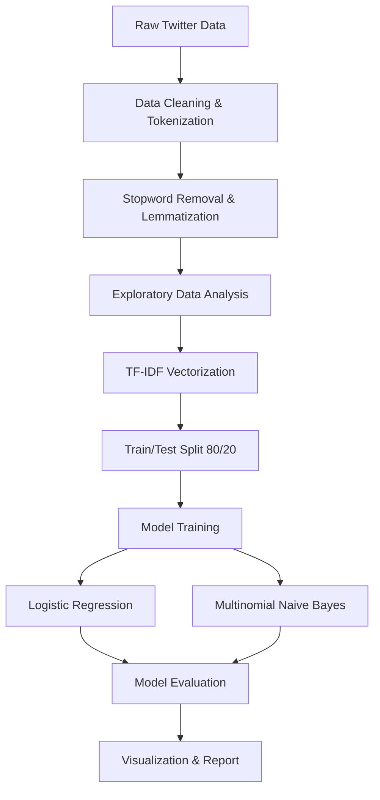
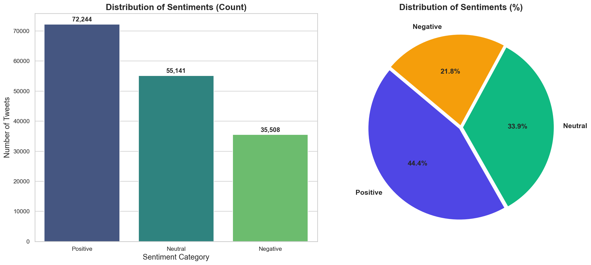
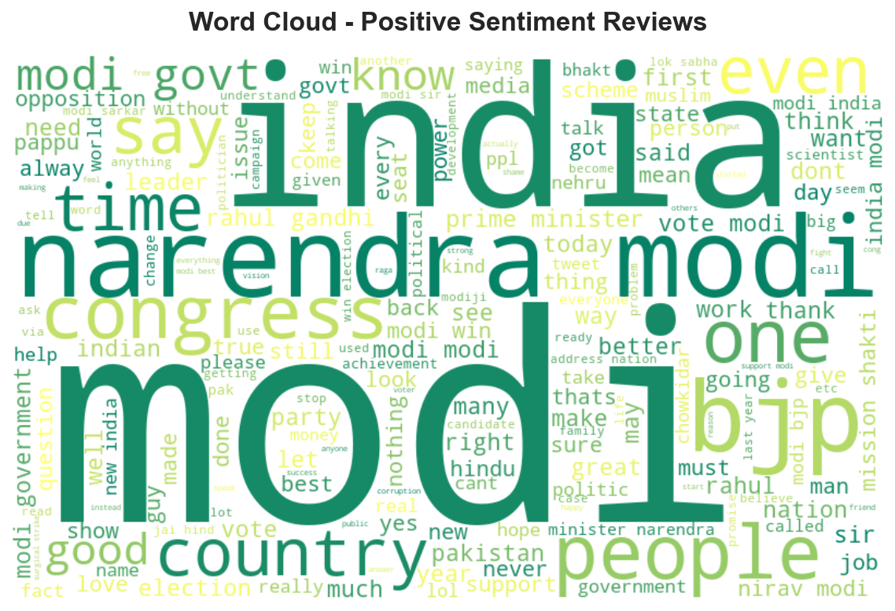
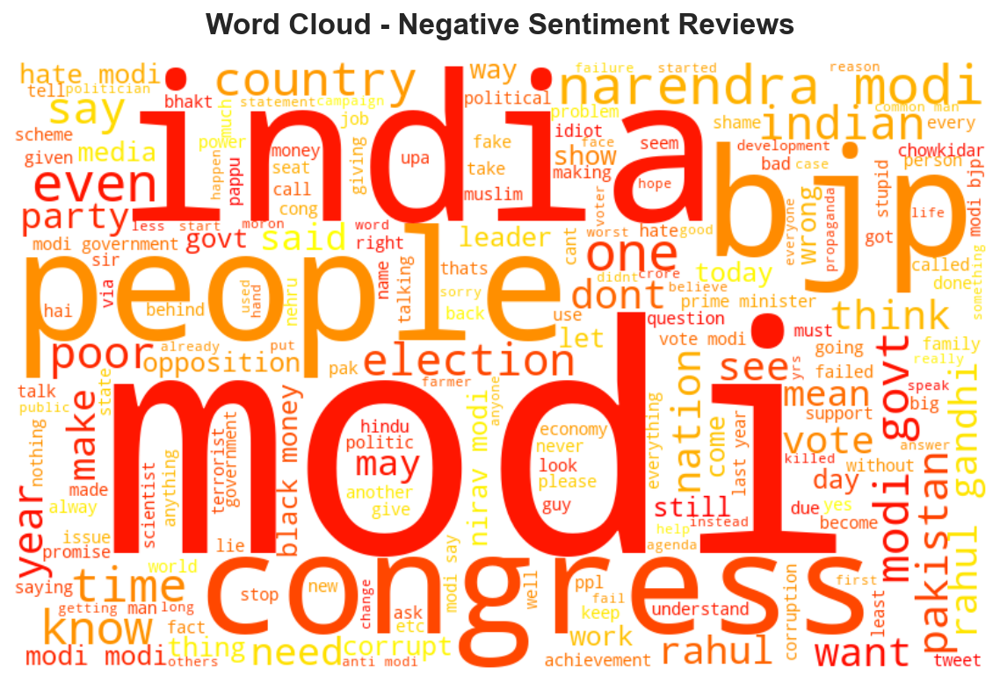
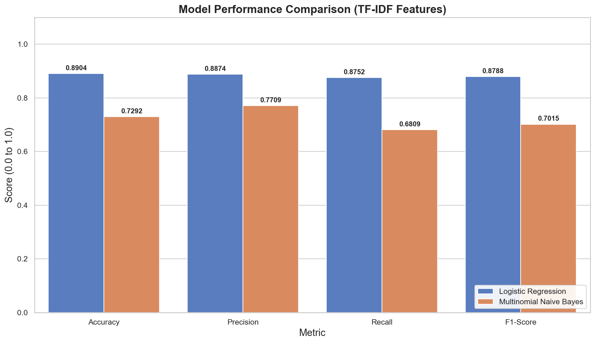
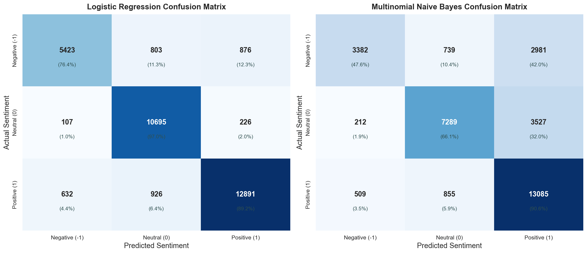

# Sentiment Analysis System (NLP)
### Oasis Infobyte Data Analytics Internship - Project 1 (Level 1)
**Intern:** Jasmin Jamadar  
**Role:** Data Analyst Intern

---

## 📌 Project Overview
This repository contains a complete, submission-grade **Sentiment Analysis System** built during the Oasis Infobyte Data Analytics Internship. The primary objective is to process, analyze, and build a machine learning pipeline that classifies unstructured text data (tweets) into three sentiment categories:
*   **Positive (1)**
*   **Neutral (0)**
*   **Negative (-1)**

The system leverages state-of-the-art Natural Language Processing (NLP) techniques for text preprocessing, uses **TF-IDF Vectorization** for feature extraction, and evaluates two distinct classification algorithms: **Logistic Regression** and **Multinomial Naive Bayes**.

---

## 📊 Performance Summary
Logistic Regression outperformed Multinomial Naive Bayes across all core classification metrics:

| Model | Accuracy | Precision (Macro) | Recall (Macro) | F1-Score (Macro) | Training Time |
| :--- | :---: | :---: | :---: | :---: | :---: |
| **Logistic Regression** | **89.04%** | **88.74%** | **87.52%** | **87.88%** | ~5.04 seconds |
| **Multinomial Naive Bayes** | 72.92% | 77.09% | 68.09% | 70.15% | **~0.02 seconds** |

*Recommendation:* **Logistic Regression** is the recommended model for production/deployment due to its superior capability in handling neutral sentiment and separating high-overlapping feature patterns.

---

## 📂 Directory Structure
The project is organized in a clean, professional, and reproducible structure:
```directory
Project_1_Sentiment_Analysis
│
├── Dataset
│   └── Twitter_Data.csv            # Raw dataset containing cleaned text and sentiment labels
│
├── Notebook
│   └── Sentiment_Analysis.ipynb    # End-to-end Jupyter Notebook (loading, EDA, training, plots)
│
├── Report
│   └── Sentiment_Analysis_Report.md # Formal, internship-level project report and analysis
│
├── Visualizations
│   ├── sentiment_distribution.png  # Class count bar chart and percentage pie chart
│   ├── wordcloud_positive.png      # Word cloud for positive sentiment terms
│   ├── wordcloud_negative.png      # Word cloud for negative sentiment terms
│   ├── confusion_matrix.png        # Side-by-side model confusion matrices heatmaps
│   └── model_comparison.png        # Bar chart comparing Accuracy, Precision, Recall, and F1
│
└── README.md                       # Documentation and project overview (this file)
```

---

## 🛠️ Installation & Setup
To run this project locally, follow these steps:

### 1. Prerequisites
Ensure you have **Python 3.8+** installed. You will also need standard scientific python libraries.

### 2. Clone the Repository & Install Dependencies
Install the required python packages:
```bash
pip install pandas numpy matplotlib seaborn nltk wordcloud scikit-learn
```

### 3. Running the Jupyter Notebook
Navigate to the `Notebook` directory and start the Jupyter environment:
```bash
cd Notebook
jupyter notebook Sentiment_Analysis.ipynb
```

---

## 🧠 NLP Preprocessing & Modeling Pipeline
The project follows a rigorous NLP pipeline:



1.  **Lowercasing**: Normalizing text to lower case.
2.  **URL & HTML Clean**: Deleting web addresses (`http/https`) and markup tags.
3.  **Special Characters & Punctuation Removal**: Filtering out numbers and symbols, retaining only letters.
4.  **Tokenization**: Segmenting sentences into token lists.
5.  **Stopwords Removal**: Removing common, non-sentiment words (e.g., 'and', 'the', 'is') using the `NLTK` stopwords list.
6.  **Feature Extraction**: Vectorizing preprocessed tokens using `TfidfVectorizer` (with `max_features=25000` and `ngram_range=(1,2)`).

---

## 📈 Visualizations Gallery

Here are the key visual insights generated from the dataset (saved in the `Visualizations` folder):

### 1. Sentiment Class Distribution
A slight imbalance exists in the dataset, with positive sentiments dominating:


### 2. Key Term Word Clouds
*   **Positive Sentiment**: Dominant keywords include `modi`, `vote`, `great`, `support`, `good`, `welcome`, and `clean`.
*   **Negative Sentiment**: Dominant keywords include `nonsense`, `drama`, `corruption`, `state`, and `fail`.

| Positive Sentiments Word Cloud | Negative Sentiments Word Cloud |
| :---: | :---: |
|  |  |

### 3. Model Performance Comparison
Logistic Regression exhibits high consistency across all evaluation metrics:


### 4. Confusion Matrices
*   **Logistic Regression** maintains strong true positive rates, especially for neutral and positive tweets.
*   **Naive Bayes** struggles, misclassifying a high volume of negative tweets as positive (causing high false positives).


---

## 📝 Key Analytical Insights
1.  **Political Focus**: The word clouds indicate the dataset is heavily centered around political discourse (specifically referring to Narendra Modi and elections).
2.  **Ambiguity in Neutrals**: Neutral tweets were categorized with high recall by Logistic Regression, suggesting the model successfully identified factual statement patterns versus opinionated language.
3.  **Bayesian Limitations**: Multinomial Naive Bayes' assumption of feature independence and standard TF-IDF weighting works poorly for short negative tweets when negative words also appear in mixed-opinion contexts.

---

## 🎓 Acknowledgment
This project was developed as part of the **Oasis Infobyte Data Analytics Internship**. Special thanks to the Oasis Infobyte team for providing the structure and opportunity to work on real-world NLP problems.
