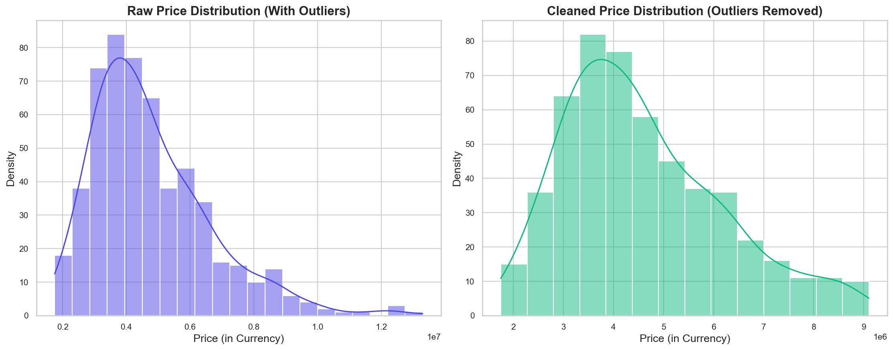
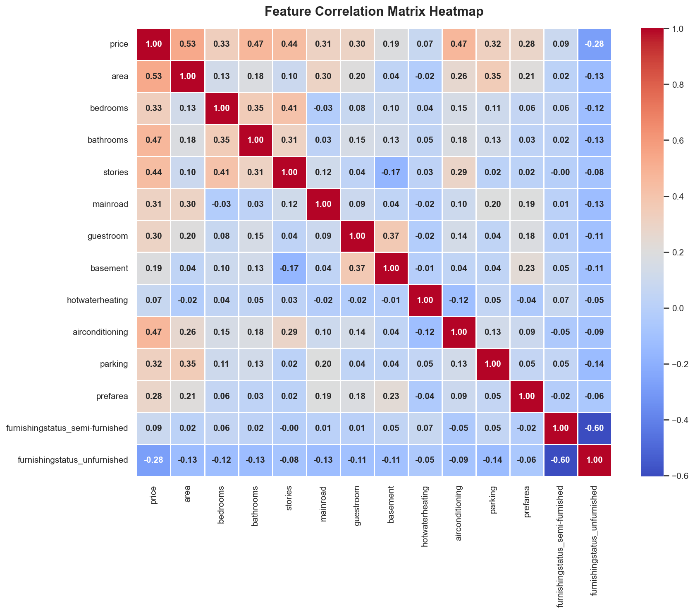
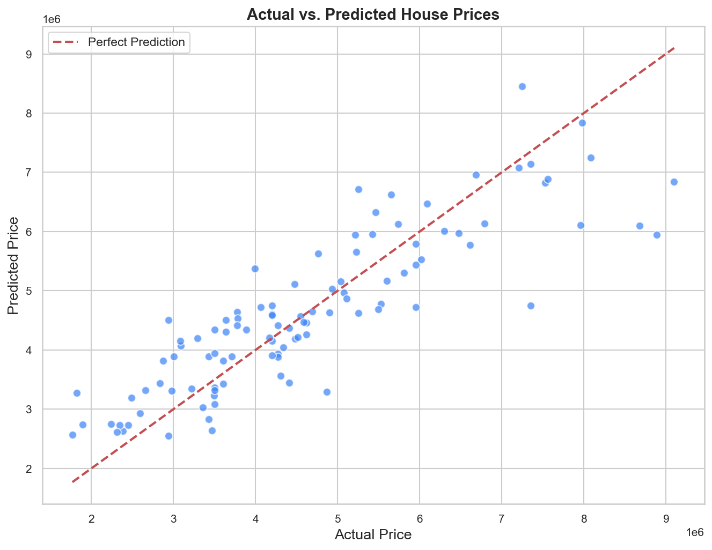
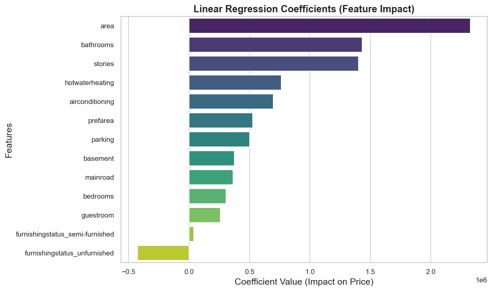
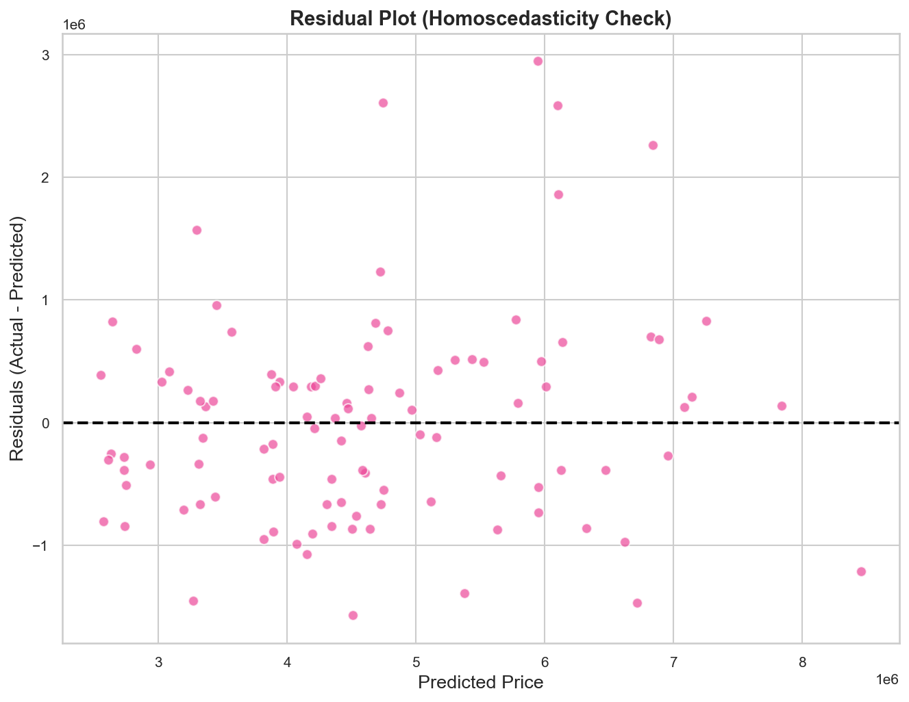

# House Price Prediction using Linear Regression
### Oasis Infobyte Data Analytics Internship - Project 2 (Level 2)
**Intern:** Jasmin Jamadar  
**Role:** Data Analyst Intern

---

## 📌 Project Overview
This repository houses the second project of the Oasis Infobyte Data Analytics Internship: a **House Price Prediction System** built on multivariate Linear Regression. The goal is to predict residential property prices in the Delhi region based on structural attributes (area, bedrooms, bathrooms, stories, parking) and locational/amenity features (main road access, guestroom, basement, hot water, air conditioning, preferred area).

By conducting thorough Exploratory Data Analysis (EDA) and robust preprocessing (outlier filtering, categorical encoding, feature scaling), we establish a highly interpretable multiple linear regression model that explains **74.52%** of price variance.

---

## 📊 Model Performance Summary
The Multiple Linear Regression model was trained on an 80% train split and evaluated on a 20% test split. 

| Metric | Score / Value | Meaning / Interpretation |
| :--- | :---: | :--- |
| **R-squared ($R^2$) Score** | **74.52%** | The model explains 74.52% of the variance in house prices. |
| **Mean Absolute Error (MAE)** | **630,394.79** | On average, predictions deviate by ~6.30 Lakhs from actual prices. |
| **Root Mean Squared Error (RMSE)** | **834,574.81** | Standard deviation of prediction residuals is ~8.35 Lakhs. |

*Note: The target pricing metrics are calculated in raw local currency units (Rupees/Lakhs) for business interpretability.*

---

## 📂 Directory Structure
The project folder structure is organized for reproducibility and portfolio presentation:
```directory
Project_2_House_Price_Prediction
│
├── Dataset
│   └── Housing.csv                 # Raw housing records containing 545 rows and 13 variables
│
├── Notebook
│   └── House_Price_Prediction.ipynb # Structured Jupyter Notebook with comments and markdown
│
├── Report
│   └── House_Price_Prediction_Report.md # Formal, internship-level analysis and business report
│
├── Visualizations
│   ├── house_price_distribution.png # Distribution of prices (before vs. after outlier removal)
│   ├── correlation_heatmap.png      # Feature correlation heatmap (numerical & encoded)
│   ├── actual_vs_predicted.png      # Scatter plot of predictions vs. ground truth
│   ├── top_features.png             # Bar chart of regression coefficients (feature weights)
│   └── residual_plot.png            # Model diagnostic plot showing residual spread
│
└── README.md                       # Comprehensive project documentation (this file)
```

---

## 🛠️ Tech Stack & Dependencies
*   **Language:** Python 3.8+
*   **Data Wrangling:** Pandas, NumPy
*   **Visualization:** Matplotlib, Seaborn
*   **Data Modeling:** Scikit-Learn
*   **Diagnostics:** Statsmodels (for VIF / diagnostic analyses)

### Installation
To install the required libraries, execute:
```bash
pip install pandas numpy matplotlib seaborn scikit-learn
```

---

## 🧠 Preprocessing & Feature Engineering Pipeline
To ensure standard linear regression assumptions are met, the pipeline performs:
1.  **Outlier Filtering**: Continuous features (`price` and `area`) were checked using the Interquartile Range (IQR) method. Values outside $[Q1 - 1.5 \times IQR, Q3 + 1.5 \times IQR]$ were dropped (removing 25 outlier records to build a stable OLS model).
2.  **Binary Mapping**: Non-numeric fields (`mainroad`, `guestroom`, `basement`, `hotwaterheating`, `airconditioning`, `prefarea`) were mapped: `yes -> 1` and `no -> 0`.
3.  **One-Hot Encoding**: The categorical variable `furnishingstatus` was encoded into dummy variables (`semi-furnished`, `unfurnished`) with the first category dropped to avoid the dummy variable trap.
4.  **Feature Scaling**: Continual features (`area`, `bedrooms`, `bathrooms`, `stories`, `parking`) were scaled using `MinMaxScaler` fitted on the training split, preventing test data leakage.

---

## 📈 Visualizations Gallery

The following visual outputs are generated and saved in the `Visualizations` folder:

### 1. House Price Distribution (Outlier Impact)
Removing outliers from the tail helps correct the skewness and improves the normality of residuals:


### 2. Feature Correlation Heatmap
Shows the relationships between structural features, amenities, and price:


### 3. Actual vs. Predicted House Prices
The model's predictions align closely with the red diagonal 1-to-1 line, showing strong fit:


### 4. Linear Regression Coefficients (Feature Weights)
The coefficients of scaled variables indicate feature importance. `area`, `bathrooms`, and `stories` are the top price drivers:


### 5. Residual Scatter Plot
Residuals are distributed randomly around the 0-line, satisfying the homoscedasticity assumption:


---

## 📝 Key Insights & Business Recommendations

### Core Insights
*   **Size Matters Most**: Property **Area** has the highest positive correlation with price (scaled coefficient weight of **`+23.28 Lakhs`**).
*   **Structural Additions**: Adding extra **bathrooms** (`+14.32 Lakhs`) or building additional **stories** (`+14.00 Lakhs`) adds significant asset value.
*   **Climate Control Premium**: Properties with **air conditioning** command a premium of **`+6.97 Lakhs`**, highlighting demand for luxury features in warm climates.
*   **Unfurnished Discount**: Selling a property as unfurnished reduces its estimated value by **`4.28 Lakhs`** compared to a furnished base model.

### Actionable Business Recommendations
1.  **For Property Developers**: Focus on maximizing floor space index (Area) and structural counts (bathrooms/stories) during design to capture the highest return on investment.
2.  **For Home Sellers**: Invest in high-impact renovations (such as installing air conditioning, hot water heating, or staging/furnishing the house) before listing to increase pricing leverage.
3.  **For Real Estate Investors**: Target larger unfurnished homes in preferred areas, perform structural upgrades (additional bathrooms/stories) and furnish them, capturing a massive valuation arbitrage.

---

## 🎓 Acknowledgment
This project was developed as a submission-ready portfolio piece for the **Oasis Infobyte Data Analytics Internship**.
