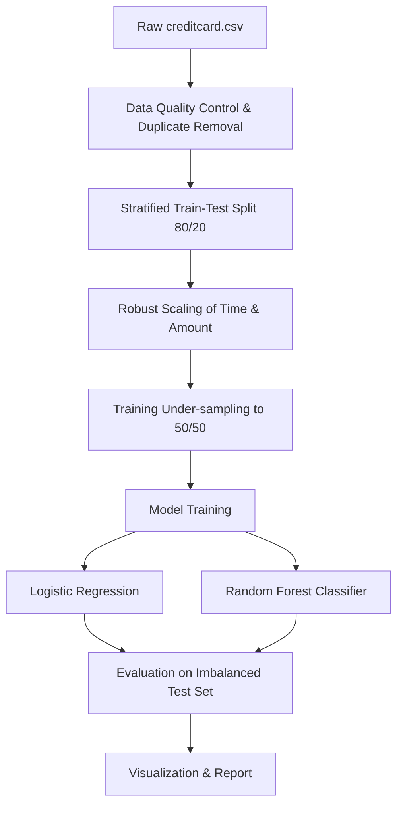
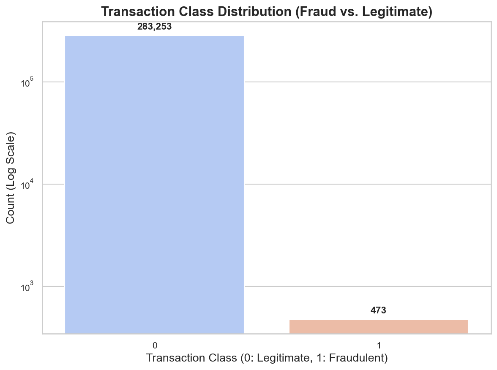
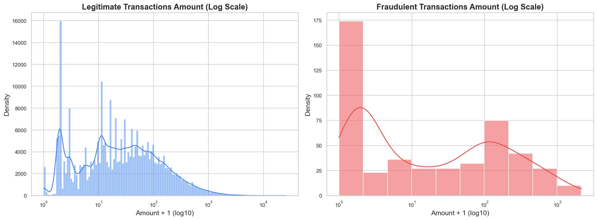
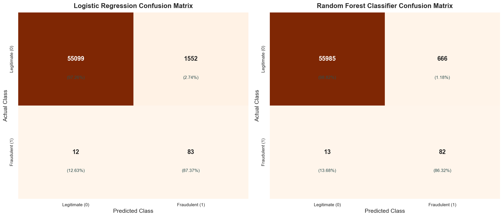
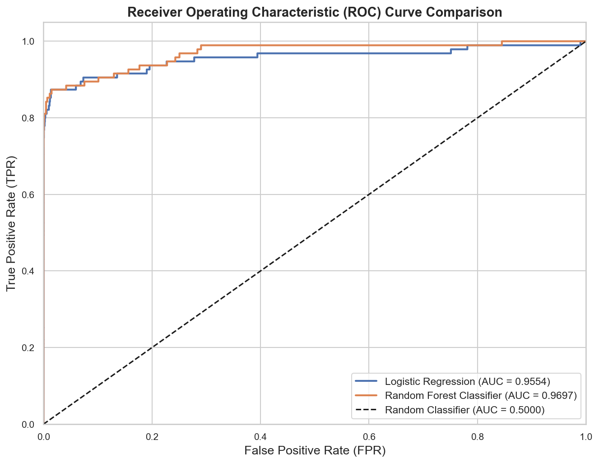
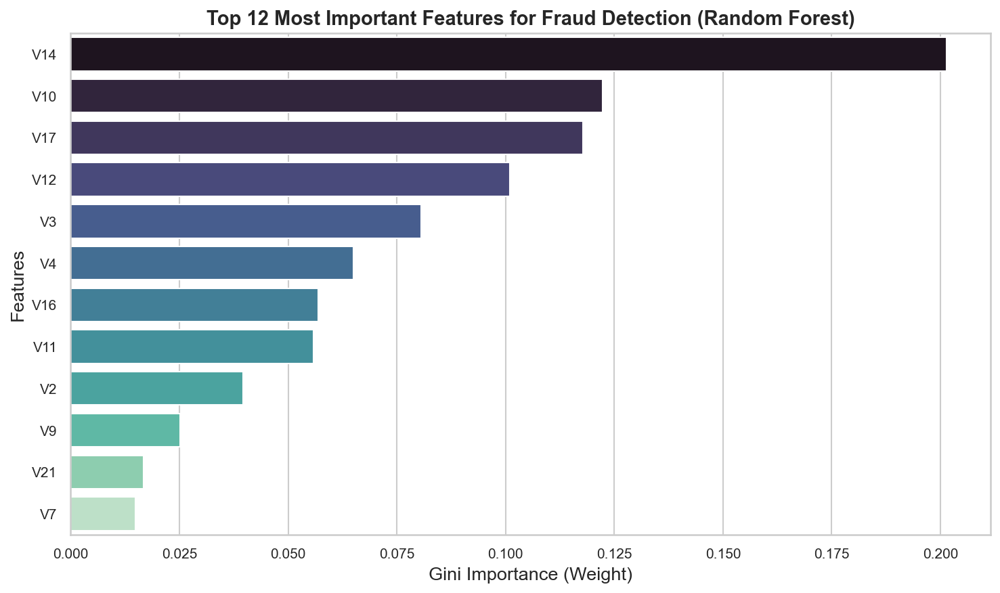

# Credit Card Fraud Detection using Machine Learning
### Oasis Infobyte Data Analytics Internship - Project 3 (Level 2)
**Intern:** Jasmin Jamadar  
**Role:** Data Analyst Intern

---

## 📌 Project Overview
This repository contains the third project of the Oasis Infobyte Data Analytics Internship: a **Credit Card Fraud Detection System**. The project addresses one of the most critical challenges in financial machine learning—handling severe class imbalance (where only **0.17%** of transactions are fraudulent). 

Using the Kaggle Credit Card Fraud Detection dataset (containing **283,726 transactions** after duplicate cleaning), we build, compare, and evaluate two distinct machine learning models:
1.  **Logistic Regression** (baseline linear classifier)
2.  **Random Forest Classifier** (non-linear ensemble tree model)

By applying **Random Under-sampling** on the training split, we train balanced models and test them under imbalanced, real-world transaction spreads.

---

## 📊 Model Performance Comparison
The classifiers were trained on a 50/50 balanced training split (756 transactions) and evaluated on an imbalanced test set (56,746 transactions).

| Metric | Logistic Regression | Random Forest Classifier | Improvement / Notes |
| :--- | :---: | :---: | :--- |
| **Accuracy** | 97.24% | **98.80%** | Random Forest reduces false positives. |
| **Precision** | 5.08% | **10.96%** | **Random Forest cuts false alarms in half.** |
| **Recall (Sensitivity)**| **87.37%** | 86.32% | Both capture over 86% of actual frauds. |
| **F1-Score** | 9.60% | **19.45%** | Random Forest offers a superior trade-off. |
| **ROC-AUC Score** | 95.54% | **96.97%** | Random Forest shows stronger separation. |
| **Training Speed** | **0.02 seconds** | 0.16 seconds | Both train in under a quarter of a second. |

### Core Insights
*   **Recall is King**: In fraud detection, missing a fraud transaction (False Negative) has far higher financial consequences than a false alarm (False Positive). Both models excel by catching **>86%** of frauds.
*   **False Alarm Mitigation**: Logistic Regression flags 1,624 false alarms, while **Random Forest flags only 666**, making Random Forest far more viable for operations by saving analyst review time.

---

## 📂 Directory Structure
```directory
Project_3_Fraud_Detection
│
├── Dataset
│   └── creditcard.csv              # Ingested dataset containing 284,807 transactions (31 columns)
│
├── Notebook
│   └── Fraud_Detection.ipynb       # Well-structured, fully commented Jupyter Notebook
│
├── Report
│   └── Fraud_Detection_Report.md   # Formal internship analysis and final project report
│
├── Visualizations
│   ├── fraud_distribution.png      # Class counts (log-scale) showing extreme imbalance
│   ├── correlation_heatmap.png      # Correlation heatmap of features V1-V28, Time, Amount, Class
│   ├── transaction_amount_distribution.png # Distribution of amounts for legimate vs fraud
│   ├── confusion_matrix.png        # Comparative confusion matrix heatmaps
│   ├── roc_curve.png               # ROC curves comparison with AUC scores
│   └── feature_importance.png      # Gini importance bar chart of top predictors
│
└── README.md                       # Main project documentation (this file)
```

---

## 🛠️ Installation & Setup
To run this project locally, follow these steps:

### 1. Prerequisites
Ensure you have **Python 3.8+** installed.

### 2. Install Required Packages
```bash
pip install pandas numpy matplotlib seaborn scikit-learn
```

### 3. Open the Jupyter Notebook
```bash
cd Notebook
jupyter notebook Fraud_Detection.ipynb
```

---

## 🧠 Machine Learning Pipeline


1.  **Duplicate Removal**: 1,081 duplicate transactions were detected and deleted, ensuring metrics are not artificially inflated.
2.  **Stratified Split**: Reserves 20% of data (56,746 samples) for testing, matching the minority ratio.
3.  **Robust Scaling**: Time and Amount are scaled using `RobustScaler` to limit influence of transaction amount outliers.
4.  **Training Under-sampling**: Samples non-fraud records in the training split to match the count of fraud records, ensuring a balanced 756-row dataset for fitting.
5.  **Performance Evaluation**: Models predict on the holdout test set to get realistic precision and recall metrics.

---

## 📈 Visualizations Gallery
*(All charts are saved in the `Visualizations` folder)*

### 1. Transaction Class Distribution
The dataset is extremely imbalanced, requiring log scaling to show the Fraud class:


### 2. Transaction Amount Distribution
Legitimate transactions cluster in smaller amounts, whereas fraudulent transactions have distinct profiles:


### 3. Model Confusion Matrices
Random Forest correctly identifies 82 frauds while raising only 666 false alarms (vs. 1,624 in Logistic Regression):


### 4. ROC-AUC Comparison Curves
Both models show exceptional capability to separate classes, with Random Forest achieving a **96.97%** AUC:


### 5. Gini Feature Importance (Random Forest)
The PCA-transformed features `V14`, `V10`, `V17`, and `V12` are the most critical predictors of fraudulent activity:


---

## 📝 Key Analytical Insights & Recommendations
1.  **Operational Savings**: Random Forest is highly recommended for production since it maintains similar high fraud coverage (86% Recall) as Logistic Regression while reducing false positive investigation costs by **59%**.
2.  **Critical Indicators**: Transaction profiles exhibiting sudden deviations in latent factors `V14`, `V10`, and `V12` represent the highest risk indicator.
3.  **Real-Time Recommendations**: 
    - **Step-Up Authentication**: Trigger mandatory 2-Factor OTP verification for transactions flagged as risky.
    - **Isolation Checks**: Apply additional velocity checks (e.g. number of transactions per minute) on cards showing unusual activity in the top features.

---

## 🎓 Acknowledgment
Developed as part of the **Oasis Infobyte Data Analytics Internship**. Special thanks to the Oasis Infobyte team for the guidance and portfolio structure.
